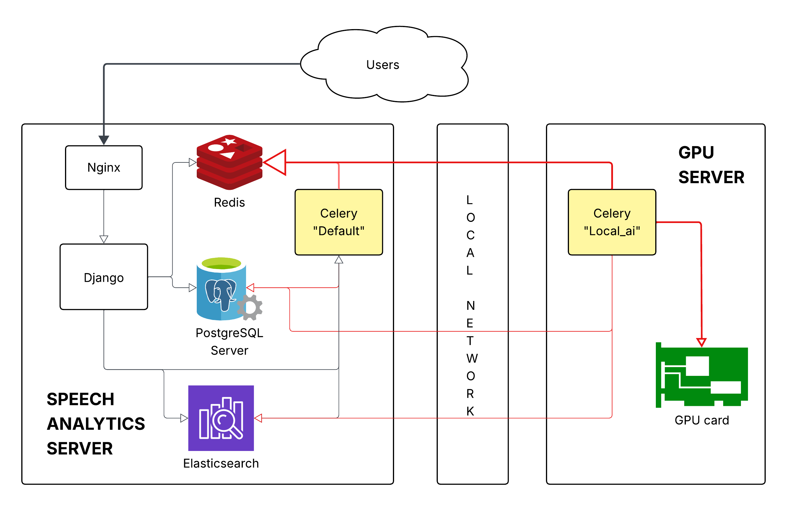

# Deployment Overview

Production runs as **two servers on a private LAN**: a **Speech Analytics server** that hosts
the web application and all stateful services, and a dedicated **GPU server** that runs the
local-AI transcription/diarization workers. The GPU server reaches the data services
(PostgreSQL, Redis, Elasticsearch) over the private network; those ports are firewalled so
only the GPU server can connect.

## Speech Analytics server (Debian 12)

The web + data tier. Components, and what each provides:

- **Python 3.13 runtime** — built from source for the application virtualenv.
- **PostgreSQL** — primary database. Uses least-privilege roles: a read-only *reporting*
  user and a read-write user for the GPU server. Remote access is restricted to the GPU host
  by the firewall (below).
- **Redis** — Celery broker, cache, and the pause/resume control channel. Exposed over a Unix
  socket locally and over the LAN to the GPU server.
- **Django application** — initialized with database migrations and seed fixtures (roles,
  campaigns, users, default config).
- **Gunicorn** — WSGI application server, managed as a systemd socket + service.
- **Elasticsearch** — full-text search over transcript segments. A dedicated indexer role and
  user are provisioned, and the search index is rebuilt through a Django management command.
- **Celery (default queue)** — systemd service handling the application's out-of-band tasks.
- **Flower** — Celery monitoring dashboard, behind HTTP basic auth and reverse-proxied.
- **Nginx** — reverse proxy in front of Gunicorn; also serves static and media files and the
  built MkDocs documentation site, and blocks direct-IP access.
- **nftables firewall** — restricts the PostgreSQL, Redis, and Elasticsearch ports so they are
  reachable only from the GPU server.
- **OS tuning** — reduced swappiness and disabled IPv6.

## GPU server (Ubuntu, Python 3.13)

The local-AI worker tier. It holds no state of its own:

- **Remote data clients** — connects to the Speech Analytics server's PostgreSQL, Redis, and
  Elasticsearch over the private network.
- **Local-AI dependencies** — installed from `requirements/localai`; the pyannote diarization
  model is fetched via the `download_pyannote` management command.
- **CUDA** — GPU libraries made available on `LD_LIBRARY_PATH`.
- **Celery (`local_ai` CUDA queue)** — systemd service that runs Whisper transcription and
  pyannote diarization on the GPU at a configured concurrency.

